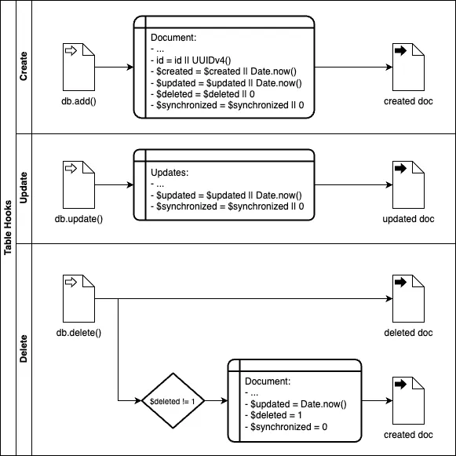
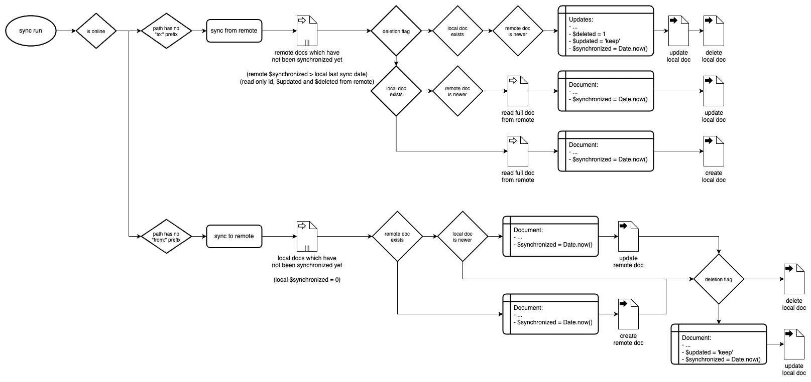

# Dexie MySQL Synchronization

Synchronization between local IndexedDB and MySQL Database.

With optional user authentication. Powered by [Dexie.js](https://dexie.org/) and [PHP CRUD API](https://github.com/mevdschee/php-crud-api).

## Demo

1. Install [Docker](https://www.docker.com/) and [Node.js](https://nodejs.org/)
2. Open the Terminal and copy paste:

    ```bash
    git clone https://github.com/scriptPilot/dexie-mysql-sync.git
    cd dexie-mysql-sync && npm install && cd demo-app && npm install && npm run dev
    ```

3. Open the **Demo App** at http://localhost:5173 in multiple browsers and play with the synchronization.
   
   Open **phpMyAdmin** at http://localhost:8080, login with `root`:`root` and take a look at the database.


## Installation

1. Create a new app project:

    ```bash
    npm create vite
    ```

2. Add a PHP and MySQL backend:

    ```bash
    npx add-php-backend
    ```
    
3. Install required dependencies:

    ```bash
    npm install
    npm install dexie
    npm install dexie-mysql-sync
    ```

## Usage

Based on the installation path above.

1. Modify the `schema.sql` file:

    ```sql
    CREATE TABLE IF NOT EXISTS `tasks` (

      -- Required columns per table
      `id` VARCHAR(36) NOT NULL PRIMARY KEY,
      `userId` INTEGER(8) NOT NULL DEFAULT 0,
      `$created` BIGINT(14) NOT NULL DEFAULT 0,
      `$updated` BIGINT(14) NOT NULL DEFAULT 0,
      `$deleted` INTEGER(1) NOT NULL DEFAULT 0,
      `$synchronized` BIGINT(14) NOT NULL DEFAULT 0,
    
      -- Optional customized columns per table
      `title` VARCHAR(255) NOT NULL,
      `done` INTEGER(1) NOT NULL DEFAULT 0
    
    ) ENGINE=InnoDB DEFAULT CHARSET=utf8mb4 COLLATE=utf8mb4_general_ci;
    ```

2. Create a `store.js` file:

    ```js
    // Import Dexie.js
    import Dexie from 'dexie'

    // Import the sync hook
    import Sync from 'dexie-mysql-sync'

    // Setup the local database
    // Adding $created and $deleted as index allows to query on these fields
    const db = new Dexie('databaseName')
    db.version(1).stores({
      tasks: '++id, title, $created, $deleted'
    })

    // Start the synchronization
    const sync = new Sync()
    sync.add(db.tasks, 'tasks')

    // Export the database and sync objects
    export { db, sync }
    ```

3. Use the database according to the [Dexie.js documentation](https://dexie.org/), example `main.js` file:

    ```js
    import { db } from './store'
    db.tasks.add({ title: 'New Task' }).then(
      db.tasks.where('$deleted').notEqual(1).reverse().sortBy('$created').then(console.log)
    )
    ```

Run `npm run dev`, open http://localhost:5173 and see how the task list is logged to the console.

Open phpMyAdmin at http://localhost:8080, login with `root`:`root` and take a look at the database.

The required properties `id`, `userId`, `$created`, `$updated`, `$deleted` and `$synchronized` are set and updated automatically, you do not need to modify them manually. By default, UUIDv4 is used for new ids.

When the user is authenticated with `login()`, new records will get the `userId` property automatically and all `read`, `list`, `update` and `delete` requests are limited to the users records (see [Multi Tenancy Documentation](https://github.com/mevdschee/php-crud-api#multi-tenancy-support)).

## Function Details

### useSync(endpoint)

Intializes the synchronization API.

- `endpoint`: `<string>`, *optional*, [PHP CRUD API](https://github.com/mevdschee/php-crud-api?tab=readme-ov-file#installation) endpoint, internal or external, default `/api.php`

```js
const sync = useSync()
```

#### sync.add(table, path, options)

Starts the synchronization to and from remote. Multiple browser windows are supported.

- `table`: [Dexie.js Table](https://dexie.org/docs/Dexie/Dexie.%5Btable%5D)
- `path`: `<string>`
    - basic usage
        - MySQL table name, example: `tasks`
    - with sync direction
        - prefix `to:` to sync only from local to remote, example: `to:tasks`
        - prefix `from:` to sync only from remote to local, example: `from:tasks`
    - with result reduction, effects only the remote to local sync
        - [filter](https://github.com/mevdschee/php-crud-api?tab=readme-ov-file#filters), example: `tasks?filter=done,eq,0`
        - [column selection](https://github.com/mevdschee/php-crud-api?tab=readme-ov-file#column-selection), example: `tasks?include=id,title`
        - [other ...](https://github.com/mevdschee/php-crud-api?tab=readme-ov-file#list)
- `options`: `<object>` *optional*
    - `interval`: `<number>`, default `1000` milliseconds

A local table can be synchronized with only one remote table.

A remote table can be synchronized with one or more local tables.

#### sync.emptyTable(table)

Removes all records from a local table without synchronizing them as deleted to the server.

- `table`: [Dexie.js Table](https://dexie.org/docs/Dexie/Dexie.%5Btable%5D)

#### sync.reset()

Resets all synchronizations. All local and remote documents are synchronized again.

- `database`: [Dexie.js Database](https://dexie.org/docs/Dexie/Dexie)

#### sync.register(username, password)

Creates a new user.

#### sync.login(username, password)

Logs the user in, clears all local tables and resets the synchronization.

#### sync.password(username, password, newPassword)

Updates the password of the user.

#### sync.user(callback)

Returns the use details or null.

- `callback`: `<function>` *optional*, callback on any user change with user details or null

#### sync.logout()

Logs the user out, clears all local tables and resets the synchronization.

## Flowcharts

If you are interested in the internal flows, here you are.

### Table Hooks



### Synchronization



## Maintainer

1. Apply changes to the code
2. Apply changes to the `README.md` file, flowcharts and screenshots
3. Commit changes with an issue (closure) reference
4. Run `npm version patch | minor | major` and push changes
5. Let the workflow manage the release to GitHub and NPM
